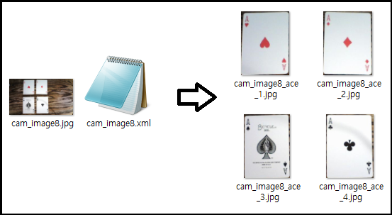
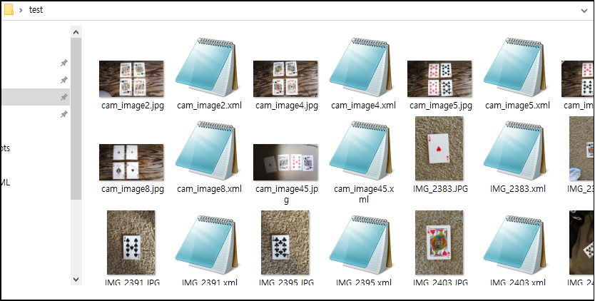
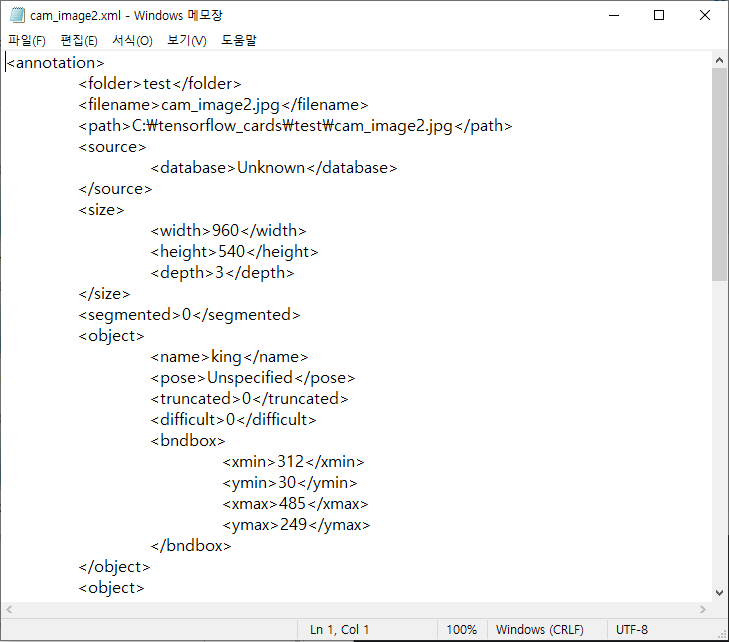
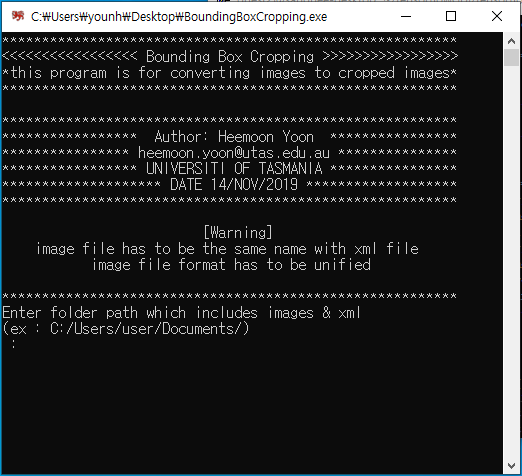
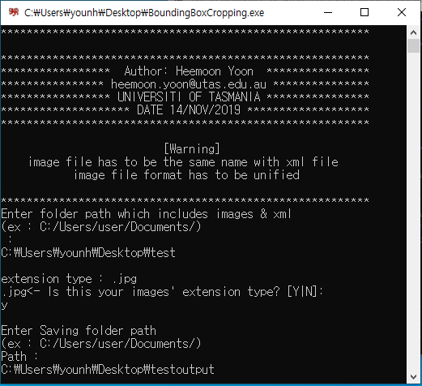
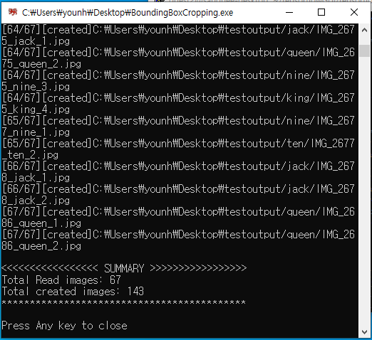
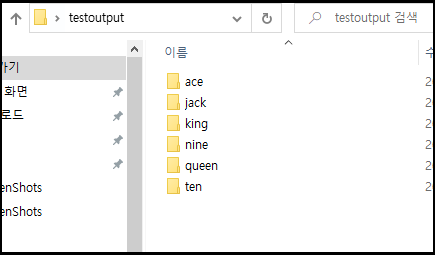
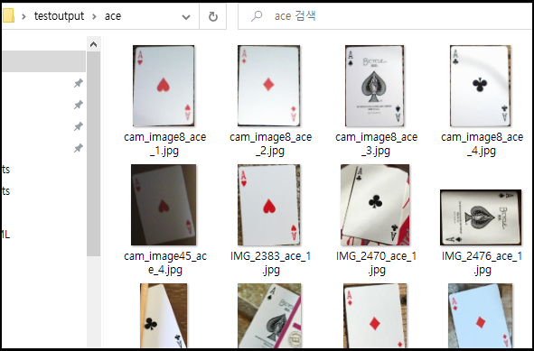

# BoundingBoxCropping
+ Cropping objects from images acrroding to corresponding xml details.
+ Save cropped images in automatically generated per-class folders.
+ User can easily crop and inspect images according to its class.


# Preparation
source folder has to be consisted of images and xml files.
```
*.jpg           -> image files to be cropped
*.xml           -> files contain position details (class name, xmin, ymin, xmax, ymax)
```
↓ Source folder structure
```
${source_root}
|——image_1.jpg
|——image_1.xml
|——image_2.jpg
|——image_2.xml
|——image_3.jpg
|——image_3.xml
|—— ...
```

# Description
↓ Contents of source folder.
\

\
\
↓ Contents of xml files
\

\


# Usage
↓ Initial screen of the program
\

\
\
↓ Enter source path, check image type, enter saving path. 
\

\
\
↓ Cropping finished
\

\
\
↓ Saved images in classified folders
\

\
\
↓ Cropped image
\

\


# Result 
↓ Result folder structure <br/>
```
${destin_folder_path}
|——cat
|   |——img1_cat_1.jpg
|   |——img1_cat_2.jpg
|   |——img1_cat_3.jpg
|   |——img2_cat_1.jpg
|   |—— ...
|——dog
|   |——img1_dog_1.jpg
|   |——img2_dog_1.jpg
|   |——img2_dog_2.jpg
|   |——img3_dog_1.jpg
|   |—— ...
|——fox
    |——img1_fox_1.jpg
    |——img2_fox_1.jpg
    |——img3_fox_1.jpg
    |——img3_fox_2.jpg
```

